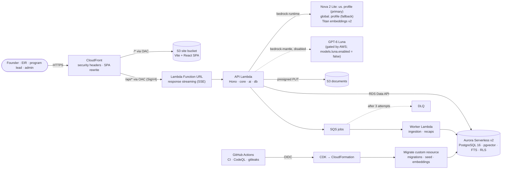

# Foundry Ascent

A persistent, evidence-grounded AI venture coach for university founders, with founder-approved memory
and human-led escalation.

[](https://github.com/satvikOS/Foundry-Ascent/actions/workflows/ci.yml)
[](https://github.com/satvikOS/Foundry-Ascent/actions/workflows/codeql.yml)
[](https://github.com/satvikOS/Foundry-Ascent/actions/workflows/security.yml)

> **All data in this system is synthetic.** Ventures, founders, EIRs and documents are invented
> ([ADR-0006](docs/architecture/adr/0006-synthetic-and-authorized-data-only.md)). Foundry Guide is an AI
> coach: it is not a person, and no human EIR authored or approved its responses.

## What it does

Each venture gets a private workspace and a coach, **Foundry Guide**, that remembers the venture across
sessions and works in six modes: diagnose, challenge, coach, teach, rehearse and route.

- **Evidence before eloquence.** Every substantive answer cites evidence from the venture's own memory and
  documents or the program's corpus, and labels each claim as fact, inference, hypothesis or
  recommendation, with uncertainty stated.
- **Memory you can see and correct.** The coach proposes typed memory (facts, decisions, experiments,
  risks, actions, …) with source links; founders approve, correct, pin or delete it.
- **Escalation is a feature.** IP, legal, investment, clinical, safety and conflict topics get educational
  framing and a structured handoff packet that the founder approves before it reaches a human EIR or
  program lead.
- **Venture-private by default.** Isolation is enforced in the service layer and by PostgreSQL row level
  security; no prompt is trusted to keep a secret.
- **Human authority.** Program leads and EIRs can suspend a persona, and admins can switch off all AI,
  without engineering help.
- Consoles for EIRs (persona releases, calibration reviews, inbox), program leads (k-anonymous portfolio,
  resources, escalation queue) and admins (access codes, kill switch, spend caps, usage, audit log).

V1 is text-first; realtime voice and avatars are deliberately deferred
([ADR-0007](docs/architecture/adr/0007-text-mode-complete-path.md), [ADR-0010](docs/architecture/adr/0010-realtime-webrtc-deferred.md)).

## Architecture



Region `us-east-1`. No VPC for Lambdas and no NAT: the API reaches Aurora through the Data API, and Aurora
pauses to zero capacity after 10 idle minutes (idle bill ≈ $1–3/month). The first request after a pause
waits ~15 s while Aurora resumes; the app shows a "Waking up your workspace…" banner and retries. The
public health check never touches the database, so monitoring cannot keep it awake. Every IAM role carries
the `FoundryAscent-Boundary` permissions boundary. Details: [system design](docs/architecture/system-design.md)
and [`infra/cdk/README.md`](infra/cdk/README.md).

**Models.** Amazon Nova 2 Lite is the primary reasoning model (`us.amazon.nova-2-lite-v1:0`), with the
`global.amazon.nova-2-lite-v1:0` profile as fallback and Titan Text Embeddings V2 for retrieval. GPT-6 Luna
is wired in but gated by AWS for this account, so it is disabled behind `models.luna.enabled = false` in
[`infra/cdk/config/production.json`](infra/cdk/config/production.json); enabling it later is a reviewed
config change ([ADR-0014](docs/architecture/adr/0014-bedrock-models-luna-nova-titan.md#enabling-luna-later)).

## Repository map

| Path                                       | Contents                                                                                                                                     |
| ------------------------------------------ | -------------------------------------------------------------------------------------------------------------------------------------------- |
| [`apps/api`](apps/api)                     | Hono API, Lambda handlers (`api`, `worker`, `migrate`), local dev server                                                                     |
| [`apps/web`](apps/web)                     | Vite 8 + React 19 SPA (TanStack Router/Query, Tailwind CSS 4, Radix)                                                                         |
| [`packages/contracts`](packages/contracts) | Zod schemas shared by browser and server: domain, API DTOs, coach response, errors                                                           |
| [`packages/db`](packages/db)               | SQL migrations with RLS, Data API and node-postgres drivers, repositories, synthetic seed                                                    |
| [`packages/ai`](packages/ai)               | Model gateway (Nova, Titan, Luna, mock), prompts, risk classifier, validators                                                                |
| [`packages/core`](packages/core)           | Domain services: auth, authorization, orchestrator, memory, retrieval, escalation, usage, audit                                              |
| [`infra/cdk`](infra/cdk)                   | AWS CDK app: Foundation, Data and App stacks, cdk-nag, tests                                                                                 |
| [`infra/iam`](infra/iam)                   | Stage-0 IAM policies and the permissions boundary                                                                                            |
| [`evals`](evals)                           | Python scenario benchmark and red-team suite against a running API                                                                           |
| [`ops/aws`](ops/aws)                       | Python ops tooling: inventory, access verification, legacy cleanup, policy upsert                                                            |
| [`scripts/smoke.mjs`](scripts/smoke.mjs)   | Post-deploy smoke test                                                                                                                       |
| [`docs`](docs)                             | [Blueprints](docs/blueprints), [system design](docs/architecture/system-design.md), [ADRs](docs/architecture/adr), [runbooks](docs/runbooks) |

## Quick start

Requires Node ≥ 22.12 (24 recommended), pnpm 10.28 (`corepack enable`) and PostgreSQL 16 with pgvector.
Full instructions, Docker option and troubleshooting: [local development](docs/runbooks/local-development.md).

```bash
pnpm install
pnpm db:reset    # local database "foundry": migrations + synthetic seed; prints a DEV owner access code
pnpm dev         # API on http://localhost:8787 (mock model), web on http://localhost:5173
```

Open <http://localhost:5173/sign-in> and enter the printed code. The mock model is deterministic, so the
whole product runs offline at no cost.

## Testing

| Suite                                                                                                    | Command                                                                          | CI job                       |
| -------------------------------------------------------------------------------------------------------- | -------------------------------------------------------------------------------- | ---------------------------- |
| Lint, format, types                                                                                      | `pnpm lint` · `pnpm format:check` · `pnpm typecheck`                             | `quality`                    |
| Unit (contracts, validators, risk classifier, authz, orchestrator with mock model, web components)       | `pnpm test`                                                                      | `quality`                    |
| Database integration: migrations, RLS for every table, authorization matrix, memory lifecycle, retrieval | `pnpm test:db`                                                                   | `database`                   |
| Lambda bundles, CDK assertions, cdk-nag, snapshots, full synth                                           | `pnpm --filter @foundry/api check:bundles` · `pnpm --filter @foundry/infra test` | `infra`                      |
| End-to-end founder journey with axe accessibility checks                                                 | `pnpm --filter @foundry/web e2e`                                                 | `e2e`                        |
| Python ops tooling and evals (offline, toolchain pinned in each `requirements-dev.txt`)                  | `ruff check` · `pytest` in `ops/aws` and `evals`                                 | `python`                     |
| Secret scanning (blocking); dependency audits and CodeQL (reported, non-blocking)                        | —                                                                                | `security.yml`, `codeql.yml` |

Generated files are checked in CI: the migrations bundle (`pnpm --filter @foundry/db gen:migrations`) and
the web route tree (`pnpm --filter @foundry/web build`).

## Deployment

Pushes to `main` that pass CI deploy automatically to production through
[`deploy.yml`](.github/workflows/deploy.yml): `cdk deploy --all` (Foundation → Data → App; database
migrations and the synthetic seed run inside the deployment, before new code goes live), then the smoke
test.

1. **Stage 0 access** (done) — an account administrator attaches the stage-0 policy to the IAM user
   ([`infra/iam/README.md`](infra/iam/README.md)) and adds its key as repository secrets; run
   **Ops - verify AWS access**. Since the bootstrap the policy is read-only plus "assume the CDK roles";
   the owner re-applies it with `infra/iam/apply-bootstrap-access.sh` in CloudShell.
2. **Bootstrap** (done) — the permissions boundary is published and CDK is bootstrapped (`CDKToolkit`).
   Both are account-owner actions in CloudShell (`infra/iam/apply-bootstrap-access.sh`,
   `infra/iam/cdk-bootstrap.sh`).
3. **Data stack first** (done) — **Platform - deploy data stack** created `FoundryAscent-Data` (Aurora,
   documents bucket, jobs queue) on its own, because Aurora takes longest.
4. **Full deploy** — merge to `main` (or run **Deploy** manually). It creates Foundation (GitHub OIDC
   provider and deploy role) and App and updates Data in place. Before `cdk deploy` the workflow decides
   whether Foundation creates, keeps or imports the GitHub OIDC provider, so an existing provider is never
   duplicated and a managed one is never deleted.
5. **Stage 1** — set the repository secret `AWS_DEPLOY_ROLE_ARN` to the `GitHubDeployRoleArn` output; later
   deploys use GitHub OIDC and the access key is retired.

**Owner access code.** There is no Cognito: people sign in with access codes
(`FA-XXXXX-XXXXX-XXXXX-XXXXX`). The owner's code is never in git: only its public prefix and scrypt hash
are in `infra/cdk/config/production.json`, and every deploy binds them to the owner principal
([access codes](docs/runbooks/access-codes.md)).

Rollback, failure handling and first-time settings: [deploy and rollback](docs/runbooks/deploy-and-rollback.md).

## Security and privacy

- **Data:** synthetic only until the University approves a data class. Venture content lives only in Aurora
  (encrypted at rest with AWS-managed keys) and the private documents bucket; models run on Amazon Bedrock
  in `us-east-1`.
- **Isolation:** service authorization on every request plus row level security under a dedicated
  `NOBYPASSRLS` role; retrieval always filters by venture before ranking; credential, ledger and audit
  tables are closed to request code.
- **Identity:** per-person access codes stored as scrypt hashes; 12-hour `HttpOnly` `SameSite=Strict`
  session cookies; lockout after repeated failures; CSRF header on every write.
- **Edge:** private origins behind CloudFront OAC, strict CSP, HSTS, `X-Frame-Options: DENY`.
- **Logging:** structured JSON with request ids; never prompts, model output, documents or memory content.
- **AI safety:** deterministic risk pre-classifier, output validators, forced escalation for high-risk
  topics, persistent AI disclosure, kill switches.
- **Cost:** the permissions boundary denies cost hazards (NAT, EC2, customer KMS keys, provisioned
  capacity); daily AI spend caps ($2.00 platform-wide, $0.50 per person) and turn rate limits are checked
  before every model call; alarms go to an SNS topic; an AWS Budget is recommended
  ([cost controls](docs/runbooks/cost-controls.md)).
- **Supply chain:** pinned actions (commit SHAs), frozen lockfile, Dependabot, gitleaks, CodeQL,
  dependency audits; no long-lived cloud credentials after stage 1.

Report vulnerabilities privately as described in [SECURITY.md](SECURITY.md).

## Documentation

- Blueprints: [`docs/blueprints/`](docs/blueprints) (01 capstone scope · 02 product and operating
  blueprint · 03 technical architecture · 04 executive proposal · 05 partnership and platform blueprint)
- [System design](docs/architecture/system-design.md) — the V1 build specification
- [Architecture decision records](docs/architecture/adr/README.md)
- [Runbooks](docs/runbooks/README.md)
- [Contributing](CONTRIBUTING.md) · [Security policy](SECURITY.md)
